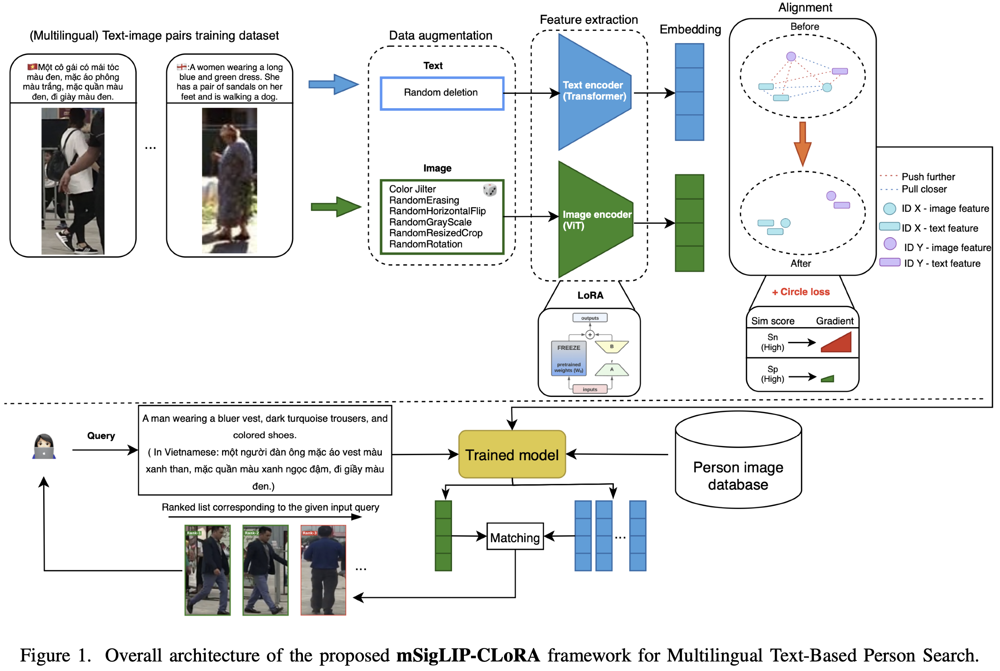
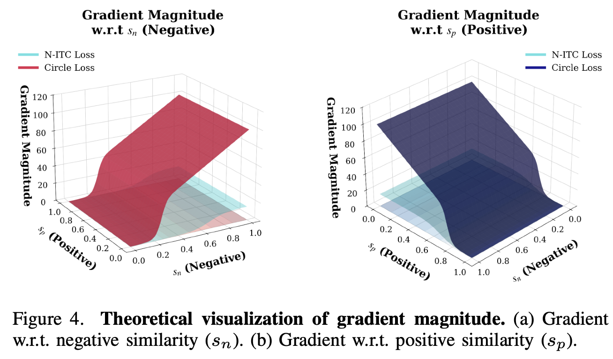
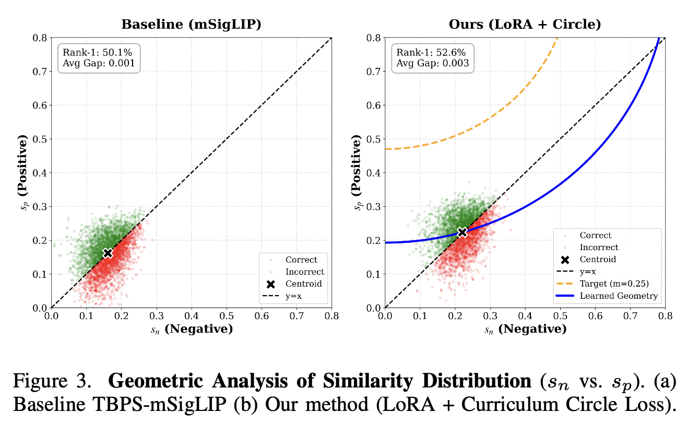
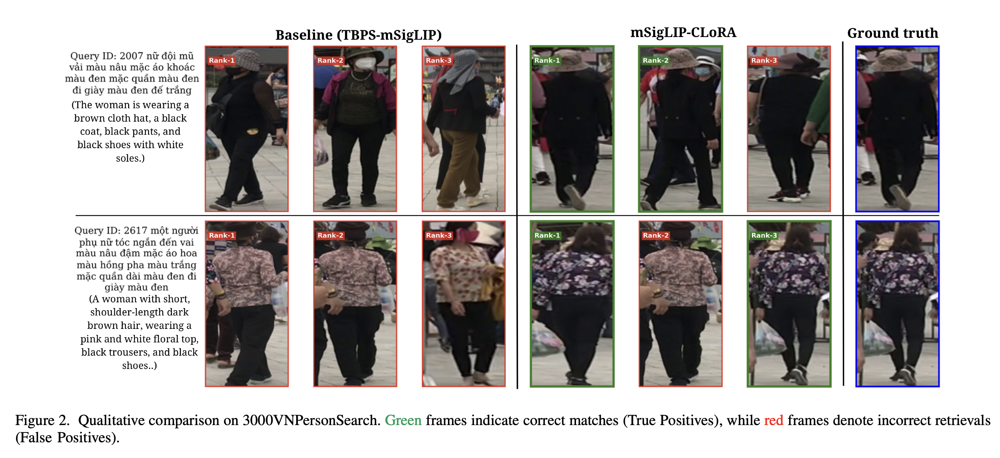

---

# Hard Negative-Aware Optimization for Multilingual TBPS via Adaptive Cross-Modal Circle Loss

This repository contains the official implementation for the paper: **"Hard Negative-Aware Optimization for Multilingual Text-Based Person Search via Adaptive Cross-Modal Circle Loss"**.

## 📖 Abstract

Multilingual Text-Based Person Search (TBPS) remains challenging in low-resource settings due to ambiguous cross-modal alignment. Although recent methods such as TBPS-mSigLIP employ noise-robust contrastive learning, they suffer from **limited gradient discrimination** between easy and hard negatives.

To address this, we propose an efficient optimization framework that integrates **Cross-modal Circle Loss** with **Low-Rank Adaptation (LoRA)**. Circle Loss enhances fine-grained discrimination via adaptive pair-wise re-weighting, while LoRA stabilizes training by constraining optimization to a low-rank subspace. We further introduce a **Curriculum Hard-Mining Schedule** to balance alignment stability and discrimination. Experiments across three typologically diverse languages — Vietnamese, English, and Chinese — demonstrate consistent improvements, establishing a new state-of-the-art **Rank@1 accuracy of 52.28%** on VnPersonSearch and **59.35%** on PRW-TPS-CN, with only **1.57% trainable parameters**.

---

## 🚀 Framework Architecture

We propose a unified framework constructed upon the **mSigLIP** foundation model. To bridge the gap in hard-negative mining, we incorporate an **Auxiliary Cross-Modal Circle Loss** for geometric refinement and utilize **LoRA** on the Transformer backbone (Query, Key, Value, Output projections) to ensure optimization stability and memory efficiency (allowing **3x** larger batch sizes). Only **5.9M / 376M parameters (1.57%)** are trainable.



*Figure 1: The overall architecture of the proposed Multilingual TBPS framework. It features a dual-pathway optimization: (1) The baseline noise-robust objectives (N-ITC, etc.) for global alignment, and (2) An auxiliary Circle Loss branch for explicit hard-negative mining, stabilized by LoRA.*

---

## 💡 Key Contributions & Analysis

### 1. Theoretical Gradient Analysis

Why does mSigLIP fail on hard negatives? We analyze the gradient dynamics of the standard Sigmoid loss (N-ITC) versus our Circle Loss.



*Figure 2: Theoretical visualization of gradient magnitude. (Left) **N-ITC (Cyan)** exhibits vanishing gradients for semi-hard negatives (), leading to insensitivity. **Circle Loss (Red)** imposes a sharp penalty after the margin, effectively mining hard negatives. (Right) Circle Loss maintains strong signals for positive pairs even as they approach similarity 1.0, preventing premature convergence.*

### 2. Geometric Refinement

Our method transforms the embedding space geometry. By applying a **Curriculum Hard-Mining Schedule** (linearly warming up the Circle Loss weight), we prevent the disruption of early global alignment while enforcing strict spherical constraints in later stages.



*Figure 3: Geometric Analysis of Similarity Distribution ( vs. ). (Left) The Baseline distribution converges linearly to the decision boundary (), causing overlap. (Right) **Ours (LoRA + Circle)** lifts the distribution towards the theoretical margin (), creating a clear spherical boundary that separates correct matches from hard negatives.*

---

## 📊 Experimental Results

We evaluate our method on **3000VnPersonSearch** (Low-resource, Vietnamese), **CUHK-PEDES** (High-resource, English), and **PRW-TPS-CN** (Chinese).

### Quantitative Performance (VN3K)

Our method with Curriculum Learning achieves State-of-the-Art performance, significantly outperforming the full fine-tuning baseline despite using only 1.57% trainable parameters.

| Method                       | R@1   | R@5   | R@10  | mAP   | mINP  |
| ---------------------------- | ----- | ------| ----- | ----- | ----- |
| TBPS-mSigLIP (Full FT)       | 49.70 | 75.93 | 84.75 | 54.96 | 48.66 |
| Ours (LoRA Only)             | 49.90 | 78.05 | 86.30 | 55.83 | 49.45 |
| Ours (LoRA + Circle Fixed)   | 50.53 | 77.78 | 86.43 | 55.94 | 49.37 |
| **Ours (LoRA + Curriculum)** | **52.28** | **79.55** | **88.03** | **57.32** | **50.57** |

*Best result with seed 2400. Mean over 3 seeds: R@1 = 51.52 +/- 0.68%.*

### Quantitative Performance (PRW-TPS-CN, Chinese)

| Method                       | R@1   | R@5   | R@10  | mAP   | mINP  |
| ---------------------------- | ----- | ------| ----- | ----- | ----- |
| TPAN                         | 21.63 | 42.54 | 52.99 | -     | -     |
| TBPS-mSigLIP (Baseline)      | 46.78 | 60.28 | 66.82 | 35.41 | 10.61 |
| **Ours (mSigLIP-CLoRA)**    | **59.35** | **70.58** | **75.48** | **46.44** | **15.10** |

### Qualitative Visualization

The baseline often retrieves visually similar distractors (hard negatives). Our method successfully discriminates fine-grained attributes (e.g., shoe color, logo details).



*Figure 4: Qualitative comparison. Green boxes indicate correct matches; Red boxes are incorrect. Note how our method ranks the Ground Truth at #1 even in challenging cases where the baseline fails.*

---

## 🛠️ Installation

### 1. Clone and Setup

```bash
git clone https://github.com/pahmlam/Research_on_CircleLoss_for_TBPS-mSigLIP.git
cd Research_on_CircleLoss_for_TBPS-mSigLIP
./setup.sh

```

### 2. Environment

We recommend using `uv` for fast dependency management.

```bash
curl -LsSf https://astral.sh/uv/install.sh | sh
uv sync

```

### 3. Prepare Data & Checkpoints

Download the `siglip-base-patch16-256-multilingual` checkpoints and organize your datasets (VN3K, CUHK-PEDES) in the root directory.

```bash
uv run scripts/prepare_checkpoints.py

```

---

## 🏃 Training

To reproduce the results, use the provided scripts. We utilize LoRA to enable large batch sizes (BS=24 on 12GB VRAM).

### Train with Curriculum Hard-Mining (Recommended)

This runs the proposed method: LoRA + mSigLIP + Auxiliary Circle Loss with a warm-up schedule.

```bash
# Run Circle Loss with LoRA fine-tuning and curriculum scheduling
./run_cir_loss.sh

```

### Train Baseline (mSigLIP)

```bash
uv run trainer.py -cn m_siglip img_size_str="'(256,256)'" dataset=vn3k loss.softlabel_ratio=0.0 trainer.max_epochs=60

```

---

## 📧 Contact

For any questions, please open an issue or contact the authors.